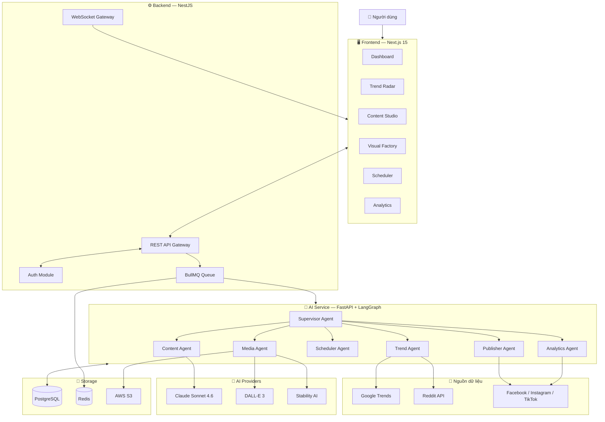

# Tổng Quan Hệ Thống — Marketing & Content Creator AI Agent

## 1. Vấn đề cần giải quyết

Các doanh nghiệp nhỏ (SMB) và content creator cá nhân tốn **3–5 giờ/ngày** để:
- Tìm kiếm xu hướng thủ công trên TikTok, Facebook, Google
- Viết caption, hashtag, script cho từng nền tảng
- Tạo hình ảnh/video minh họa
- Lên lịch và đăng bài đúng giờ
- Theo dõi hiệu quả và điều chỉnh chiến lược

**Mục tiêu:** Xây dựng hệ thống Multi-Agent AI tự động hóa toàn bộ pipeline này,
giúp tiết kiệm thời gian và tăng hiệu quả tiếp cận organic 20–40%.

---

## 2. Kiến trúc tổng thể



---

## 3. Core Pipeline (7 giai đoạn)

| Bước | Stage | Agent | Input | Output |
|------|-------|-------|-------|--------|
| 1 | **Trend Discovery** | TrendAgent | Từ khóa ngành | Danh sách trending topics + score |
| 2 | **Analysis** | TrendAgent + LLM | Trending data | Báo cáo sentiment + ranking |
| 3 | **Content Generation** | ContentAgent | Trend report | Caption, hashtag, script (3 phong cách) |
| 4 | **Media Creation** | MediaAgent | Caption đã duyệt | Image assets (S3 URL) |
| 5 | **Scheduling** | SchedulerAgent | Historical analytics | Post schedule (giờ vàng) |
| 6 | **Auto Publish** | PublisherAgent | Approved content + schedule | Published posts |
| 7 | **Performance Loop** | AnalyticsAgent | Post IDs | Metrics report + strategy update |

**Human-in-the-loop checkpoints:**
- Sau bước 3: User review & edit content trước khi tạo ảnh
- Sau bước 4: User approve/reject ảnh trước khi lên lịch

---

## 4. Tech Stack

| Layer | Technology | Version | Lý do chọn |
|-------|-----------|---------|------------|
| **Frontend** | Next.js (App Router) | 15.x | Thesis yêu cầu, RSC + SSR |
| **UI Components** | shadcn/ui + Tailwind CSS | latest | Ready-to-use, dark mode, accessible |
| **Backend API** | NestJS | 10.x | Thesis yêu cầu, TypeScript, modular DI |
| **AI Service** | FastAPI | 0.115.x | Python-native cho LangGraph/LangChain |
| **Agent Framework** | LangGraph | 0.2.x | Stateful graphs, human-in-the-loop, checkpointing |
| **LLM chính** | Claude Sonnet 4.6 (`claude-sonnet-4-6`) | latest | Hiệu năng cao, context dài |
| **Image Generation** | DALL-E 3 (OpenAI) | — | Chất lượng cao, API đơn giản |
| **Image Gen backup** | Stability AI | SD 3.5 | Chi phí thấp hơn |
| **Database** | PostgreSQL | 16.x | Thesis yêu cầu, ACID |
| **ORM (Backend)** | Prisma | 5.x | Type-safe migrations, NestJS integration |
| **ORM (AI Service)** | SQLAlchemy + Alembic | 2.x | Python standard |
| **Job Queue** | BullMQ + Redis | 5.x | Scheduling, retry logic, rate limiting |
| **Trend Crawl** | pytrends + PRAW | latest | Free, không cần API key (Google Trends) |
| **Web Scraping** | Playwright | 1.x | Dynamic content, TikTok trends |
| **Media Storage** | AWS S3 (hoặc Cloudflare R2) | — | Object storage cho ảnh generated |
| **LLM Observability** | LangSmith | — | Debug traces, prompt management |
| **Real-time** | WebSocket (NestJS Gateway) | — | Pipeline status live updates |
| **Containerization** | Docker + Docker Compose | — | Dev & prod environment |
| **Auth** | JWT + Passport.js | — | NestJS standard |
| **Version Control** | GitHub | — | Thesis yêu cầu |

---

## 5. Cấu trúc thư mục dự án

```
marketing-content/
├── strategy/                    # Tài liệu chiến lược (thư mục này)
├── frontend/                    # Next.js 15 App
│   ├── app/
│   │   ├── (auth)/
│   │   ├── dashboard/
│   │   ├── trends/
│   │   ├── content/
│   │   ├── media/
│   │   ├── schedule/
│   │   ├── analytics/
│   │   └── settings/
│   ├── components/
│   └── lib/
├── backend/                     # NestJS API
│   ├── src/
│   │   ├── auth/
│   │   ├── trends/
│   │   ├── content/
│   │   ├── media/
│   │   ├── schedule/
│   │   ├── analytics/
│   │   └── websocket/
│   └── prisma/
│       └── schema.prisma
├── ai-service/                  # FastAPI + LangGraph
│   ├── agents/
│   │   ├── trend_agent/
│   │   ├── content_agent/
│   │   ├── media_agent/
│   │   ├── scheduler_agent/
│   │   ├── publisher_agent/
│   │   ├── analytics_agent/
│   │   └── supervisor/
│   ├── tools/
│   └── main.py
└── docker-compose.yml
```

---

## 6. Giới hạn phạm vi (Out of scope)

- Không tạo/phân tích video dài (>60 giây)
- Không triển khai ở quy mô enterprise (>1000 người dùng)
- Twitter/X API không ưu tiên (chi phí cao)
- Không có tính năng paid advertising management
- TikTok publishing là stretch goal (API phức tạp)
