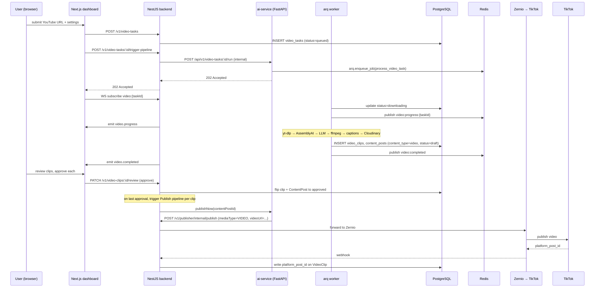
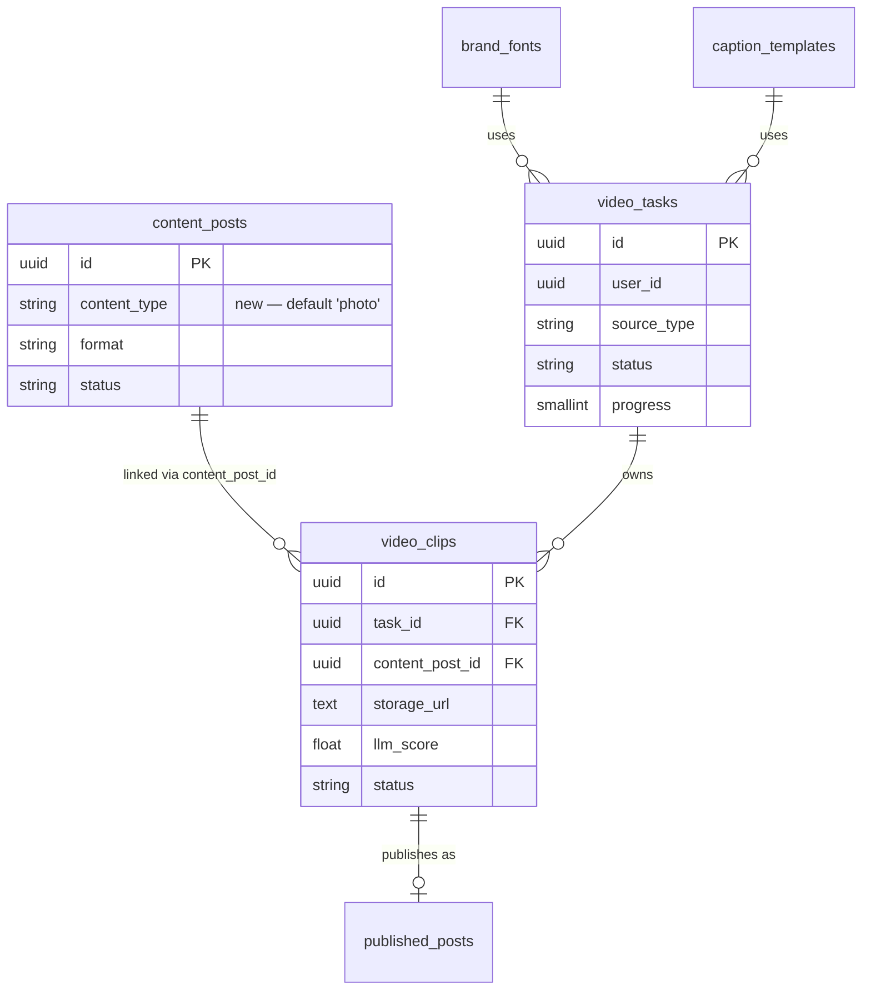
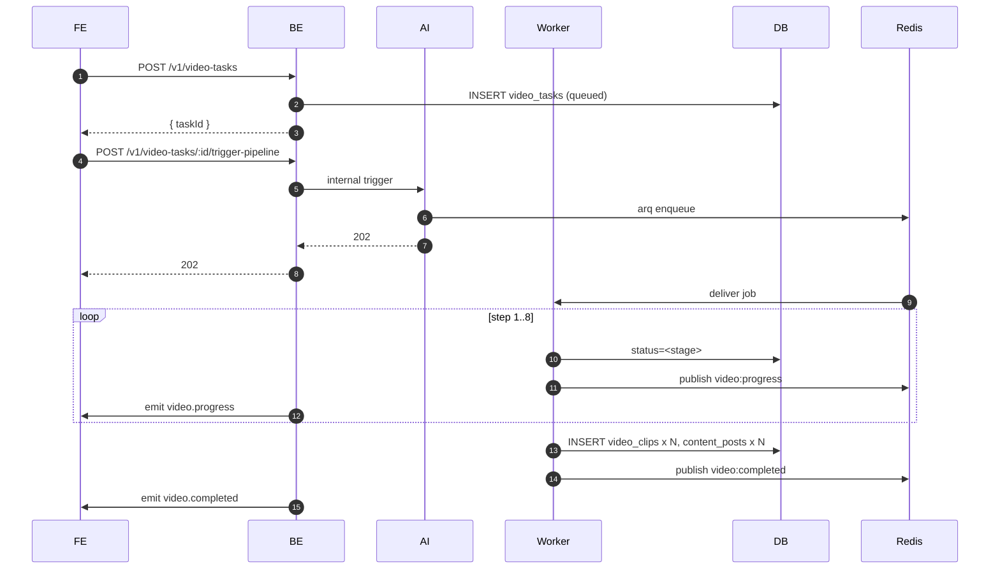
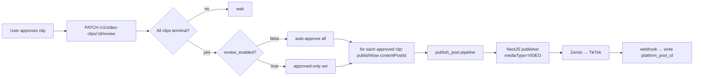
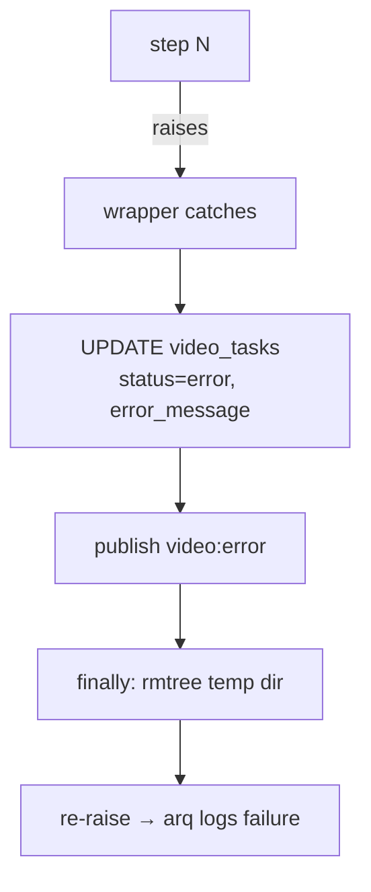

# 10 — Video Clipper Agent

> **Scope:** parallel pipeline path alongside the existing photo pipeline. Touches `ai-service` (FastAPI + LangGraph + new arq worker), `backend` (NestJS), and `frontend` (Next.js dashboard). Development-first (Cloudinary + AssemblyAI).
> **Version:** 0.4.0

---

## Table of Contents

1. [Overview](#1-overview)
2. [Architecture](#2-architecture)
3. [File Structure](#3-file-structure)
4. [Database Schema](#4-database-schema)
5. [Configuration](#5-configuration)
6. [LangGraph Pipeline](#6-langgraph-pipeline)
7. [Worker (arq)](#7-worker-arq)
8. [Storage Abstraction](#8-storage-abstraction)
9. [API Endpoints Reference](#9-api-endpoints-reference)
10. [WebSocket Events](#10-websocket-events)
11. [Frontend Pages](#11-frontend-pages)
12. [Setup & Run Instructions](#12-setup--run-instructions)
13. [Testing Guide](#13-testing-guide)
14. [Data Flow Diagrams](#14-data-flow-diagrams)
15. [Error Handling & Edge Cases](#15-error-handling--edge-cases)
16. [Environment Variables Reference](#16-environment-variables-reference)

---

## 1. Overview

The Video Clipper Agent turns a long-form video into a set of short, brand-styled TikTok clips. It accepts a YouTube/public URL or a direct file upload, transcribes the audio with word-level timestamps, asks an LLM to pick the most engaging 30–90 second segments, cuts them with ffmpeg, reframes to 9:16, burns captions in a configurable style, uploads the finished clips to Cloudinary, persists clip metadata in the `ai` schema, and routes each clip through the existing Human Review → Publish pipeline.

It is a **parallel path** to the photo pipeline: both share the Content Pool, Review, Scheduler, and Auto-Publish stages. The photo pipeline is **unchanged** by this feature.

### What Changed

- **5 new database objects** in the `ai` schema (1 column + 4 tables + 1 enum)
- **1 new LangGraph agent** (`video_clipper`) — runs entirely inside a new worker process
- **1 new worker process** (`arq`) on a dedicated `video-processing` queue
- **5 new NestJS modules** (`video-tasks`, `video-clips`, `fonts`, `caption-templates`, `media`)
- **1 extension** to the existing publisher endpoint (accepts `mediaType: VIDEO`)
- **1 extension** to the existing WebSocket gateway (adds `video.*` events with Redis-pub/sub backing)
- **2 new frontend routes** (`/video-clipper`, `/video-clipper/[taskId]`) + extensions to Content Review and Analytics
- **Cloudinary** is consolidated behind the existing `StorageBackend` abstraction

### Key Design Decisions

| Decision | Rationale |
|----------|-----------|
| **Parallel path, not a rewrite** | The photo pipeline is in production; we add a `content_type` discriminator column on `content_posts` and a new graph. Nothing on the photo path is modified. |
| **Dedicated `arq` worker** (Redis-backed async queue) | ai-service today only has APScheduler for delayed publishes — not designed for long-running CPU/IO jobs. arq is async-native (matches FastAPI), uses the Redis we already run, and is what the supoclip reference uses. |
| **AssemblyAI for word-level transcripts** | Required for accurate caption alignment. The supoclip reference is wired for AssemblyAI; we port that integration. |
| **LLM segment selection via existing `get_analyzer_llm()`** | Spec rule: "Use the existing OpenAI client for LLM calls — do not create a new one." Reuses `app/clients/openai_client.py`. |
| **Publish through Zernio (mirror photos)** | The current photo branch calls NestJS `/v1/publisher/internal/publish` → Zernio → TikTok. Video reuses this surface — the publisher DTO gains `mediaType` + `videoUrl`. Same retry, same webhook, same status flow. |
| **DB-status review gate, no LangGraph interrupt** | The photo flow has no LangGraph interrupt either — it ends at `status=draft` and the backend approval flips it. Video does the same; mixing two review-gate mechanisms would be inconsistent. |
| **Cloudinary behind `StorageBackend`** | Spec rule: "the storage abstraction must be the only place that references Cloudinary." `CloudinaryStorage` is added as a third backend alongside `LocalStorage` and `S3Storage`. |
| **Worker runs the LangGraph node directly** | We do not enqueue + poll from inside the node (the spec sketch). The whole node runs *inside* the arq job. Same outcome, half the moving parts, no 30-minute polling timeout to misfire. |

---

## 2. Architecture

### System Context

```
                                  ┌─────────────────────┐
                                  │  Cloudinary (clips, │
                                  │  fonts, uploads)    │
                                  └──────────▲──────────┘
                                             │
┌───────────┐    ┌──────────────┐    ┌───────┴────────┐     ┌──────────────┐
│  Frontend │───▶│  NestJS      │───▶│  ai-service    │────▶│  arq worker  │
│ (Next.js) │    │  Backend     │    │  (FastAPI)     │     │  (video-     │
│           │◀──▶│              │◀──▶│  enqueue only  │     │  processing) │
└───────────┘    └──────┬───────┘    └────────────────┘     └──────┬───────┘
       ▲                │                                          │
       │  WebSocket     │ ┌──────────────────┐                     │
       │  video.*       │ │  PostgreSQL      │◀────────────────────┤
       └────────────────┼▶│  (ai + app)      │                     │
                        │ └──────────────────┘                     │
                        │ ┌──────────────────┐    pub/sub          │
                        └▶│  Redis           │◀────────────────────┘
                          │  - cache         │
                          │  - arq queue     │
                          │  - video pub/sub │
                          └──────────────────┘
                                             │
                                             │
                                  ┌──────────▼──────────┐
                                  │  AssemblyAI         │
                                  │  yt-dlp / ffmpeg    │
                                  │  (in worker)        │
                                  └─────────────────────┘
```

### Agent Internal Architecture

```mermaid
flowchart TD
    A[arq job: process_video_task] --> B[video_clipper_node]
    B --> S1[Step 1: init task<br/>status=queued]
    S1 --> S2[Step 2: acquire source<br/>status=downloading]
    S2 --> S3[Step 3: transcribe<br/>status=transcribing]
    S3 --> S4[Step 4: LLM segment select<br/>status=analyzing]
    S4 --> S5[Step 5: ffmpeg cut + reframe<br/>status=clipping]
    S5 --> S6[Step 6: burn captions<br/>status=captioning]
    S6 --> S7[Step 7: upload to Cloudinary<br/>status=uploading]
    S7 --> S8[Step 8: persist clip rows<br/>status=completed]
    S8 --> CLEAN[finally: rmtree temp dir]

    S1 -. publish .-> RED[(Redis<br/>video:progress:{taskId})]
    S2 -. publish .-> RED
    S3 -. publish .-> RED
    S4 -. publish .-> RED
    S5 -. publish .-> RED
    S6 -. publish .-> RED
    S7 -. publish .-> RED
    S8 -. publish .-> RED
```

### Cross-pipeline Hand-off



---

## 3. File Structure

### New Files

```
ai-service/
├── alembic/versions/
│   └── {rev}_video_clipper.py             # Adds content_type col + 4 tables + ContentType enum
│
├── app/
│   ├── agents/video_clipper/
│   │   ├── __init__.py
│   │   ├── node.py                        # Top-level LangGraph node (9-step orchestrator)
│   │   ├── graph.py                       # StateGraph compile (single node, kept for symmetry)
│   │   ├── runner.py                      # run_video_clipper() — entry point for arq job
│   │   ├── state.py                       # VideoClipperState TypedDict
│   │   ├── prompts.py                     # LLM segment-selection prompt
│   │   ├── schemas.py                     # Pydantic models for LLM JSON response
│   │   └── steps/
│   │       ├── __init__.py
│   │       ├── download.py                # yt-dlp + Cloudinary fetch
│   │       ├── transcribe.py              # AssemblyAI client + word-level timestamps
│   │       ├── select.py                  # Build prompt → get_analyzer_llm → validate JSON
│   │       ├── cut.py                     # ffmpeg cut + 9:16 reframe
│   │       ├── caption.py                 # ASS subtitle build + ffmpeg burn
│   │       ├── upload.py                  # CloudinaryStorage.upload_video
│   │       └── persist.py                 # Write VideoClip + ContentPost rows
│   │
│   ├── clients/
│   │   └── assemblyai_client.py           # Async wrapper over AssemblyAI SDK
│   │
│   ├── core/
│   │   └── progress.py                    # publish_video_event(task_id, stage, percent, status)
│   │
│   ├── utils/
│   │   └── async_helpers.py               # run_in_thread, @async_wrap (ported from supoclip)
│   │
│   ├── workers/
│   │   ├── __init__.py
│   │   ├── video_worker.py                # WorkerSettings, process_video_task
│   │   └── job_queue.py                   # enqueue_video_task helper
│   │
│   ├── api/v1/
│   │   ├── video_tasks.py                 # Internal endpoint: /video-tasks/{id}/run
│   │   └── schemas/
│   │       └── video.py                   # Request/response Pydantic schemas
│   │
│   └── db/models/
│       ├── video_task.py
│       ├── video_clip.py
│       ├── brand_font.py
│       └── caption_template.py
│
backend/
├── src/
│   ├── video-tasks/
│   │   ├── video-tasks.module.ts
│   │   ├── video-tasks.controller.ts
│   │   └── dto/
│   │       ├── create-video-task.dto.ts
│   │       └── trigger-pipeline.dto.ts
│   ├── video-clips/
│   │   ├── video-clips.module.ts
│   │   ├── video-clips.controller.ts
│   │   └── dto/
│   │       └── review-clip.dto.ts
│   ├── fonts/
│   │   ├── fonts.module.ts
│   │   ├── fonts.controller.ts
│   │   └── dto/upload-font.dto.ts
│   ├── caption-templates/
│   │   ├── caption-templates.module.ts
│   │   ├── caption-templates.controller.ts
│   │   └── dto/create-template.dto.ts
│   └── media/
│       ├── media.module.ts
│       ├── media.controller.ts
│       └── media.service.ts               # Cloudinary SDK lives here only
│
frontend/
└── src/
    ├── app/(app)/video-clipper/
    │   ├── page.tsx                       # Task creation (URL | upload + settings)
    │   └── [taskId]/
    │       └── page.tsx                   # Progress + clip review
    │
    ├── components/video-clipper/
    │   ├── dynamic-video-player.tsx       # Ported from supoclip
    │   ├── clip-card.tsx
    │   ├── stage-indicator.tsx
    │   └── upload-dropzone.tsx
    │
    └── lib/api/
        └── video.ts                        # createVideoTask, triggerPipeline, reviewClip, listFonts, ...
```

### Modified Files

```
ai-service/
├── pyproject.toml                          # + arq, assemblyai, yt-dlp
├── Dockerfile                              # + apt install ffmpeg
├── docker-compose.yml                      # + ai-worker service (reuses ai-service image)
├── app/
│   ├── config.py                           # + ASSEMBLY_AI_API_KEY, ARQ_QUEUE_NAME, video temp dir, max upload
│   ├── api/v1/router.py                    # + include video_tasks router
│   ├── core/storage.py                     # + CloudinaryStorage backend
│   ├── core/cloudinary_uploader.py         # Internals moved behind CloudinaryStorage (back-compat shim)
│   ├── agents/publish_post/
│   │   ├── state.py                        # + content_type, video_url fields
│   │   ├── publish_node.py                 # Conditional payload: photo vs video
│   │   └── graph.py                        # resolve_and_validate handles video_url
│   └── db/models/
│       ├── enums.py                        # + ContentType enum
│       ├── content_post.py                 # + content_type column (default 'photo')
│       └── __init__.py                     # + register new models

backend/
├── package.json                            # + multer, cloudinary, @types/multer
├── prisma/schema.prisma                    # + VideoTask, VideoClip, BrandFont, CaptionTemplate; ContentPost.contentType
├── src/
│   ├── app.module.ts                       # Register new modules
│   ├── status/status.gateway.ts            # + video room + Redis subscriber for video:progress:*
│   ├── ai-service/ai-service.client.ts     # + triggerVideoPipeline
│   └── publisher/
│       ├── publisher.controller.ts         # Accept mediaType + videoUrl
│       └── dto/publish.dto.ts              # + mediaType, videoUrl optional fields

frontend/
└── src/
    ├── app/(app)/content/[id]/page.tsx     # Render <video> when contentType=='video'
    ├── app/(app)/analytics/page.tsx        # + Videos tab
    ├── components/layout/sidebar.tsx       # + Video Clipper nav entry
    └── hooks/use-socket.ts                 # + video.progress | completed | error handlers

docs/
├── FEATURES.md                             # + Video Clipper entry
└── 00-overview.md                          # + parallel-path note
```

---

## 4. Database Schema

All schema lives in the `ai` Postgres schema, owned by `ai_svc`. Alembic owns migrations; Prisma mirrors the tables read-only-ish with `@@schema("ai")` so the NestJS backend can query them. **No data migration is required** — the new `content_type` column has a server-side default of `'photo'`, so existing `content_posts` rows remain valid.

### 4.1 New Enum

```python
class ContentType(str, Enum):
    PHOTO = "photo"
    VIDEO = "video"
```

### 4.2 Column Addition: `ai.content_posts.content_type`

| Column | Type | Default | Notes |
|--------|------|---------|-------|
| `content_type` | VARCHAR(10) NOT NULL | `'photo'` | Discriminator. Existing rows backfill to `'photo'` via default. |

The existing `format` column (PostFormat enum: PHOTO/CAROUSEL/REELS/TIKTOK) is **unchanged** and continues to describe media format. `content_type` describes pipeline branch — they answer different questions.

### 4.3 Table: `ai.video_tasks`

Tracks a video processing job through its multi-stage lifecycle.

| Column | Type | Description |
|--------|------|-------------|
| `id` | UUID PK | |
| `user_id` | UUID | Owning user (FK to `app.users.id`, soft) |
| `source_type` | VARCHAR(20) | `'url'` or `'upload'` |
| `source_ref` | TEXT | YouTube URL or Cloudinary public_id |
| `status` | VARCHAR(20) | `queued` / `downloading` / `transcribing` / `analyzing` / `clipping` / `captioning` / `uploading` / `completed` / `error` / `cancelled` |
| `progress` | SMALLINT default 0 | 0–100 |
| `progress_message` | TEXT | Human-readable stage label |
| `error_message` | TEXT | Last exception message when status=`error` |
| `font_id` | UUID FK→`brand_fonts.id` | |
| `caption_template_id` | UUID FK→`caption_templates.id` | |
| `max_clips` | SMALLINT default 5 | 1–10 |
| `temp_dir` | TEXT | Path for cleanup audits |
| `scan_run_id` | UUID nullable | Optional linkage to a trend scan |
| `created_at` / `updated_at` / `started_at` / `completed_at` | TIMESTAMPTZ | |

**Indexes:** `user_id`, `status`, `created_at desc`.

### 4.4 Table: `ai.video_clips`

One row per generated short clip.

| Column | Type | Description |
|--------|------|-------------|
| `id` | UUID PK | |
| `task_id` | UUID FK→`video_tasks.id` (ON DELETE CASCADE) | |
| `content_post_id` | UUID FK→`content_posts.id` nullable | Links into the content pool |
| `clip_index` | INT | 0-based position in task |
| `storage_url` | TEXT | Cloudinary secure URL |
| `storage_public_id` | TEXT | Cloudinary public_id (for deletion) |
| `duration_seconds` | FLOAT | |
| `start_ms` / `end_ms` | INT | Source video timeline |
| `transcript_segment` | TEXT | Words covered by this clip |
| `llm_score` | FLOAT | 0–10 |
| `llm_rationale` | TEXT | Why the LLM picked this segment |
| `hook_score` / `engagement_score` | FLOAT nullable | Optional sub-scores |
| `status` | VARCHAR(20) | `draft` / `approved` / `rejected` / `published` / `failed` |
| `feedback` | TEXT nullable | Reviewer note on reject |
| `platform_post_id` | TEXT nullable | TikTok publicly_available_post_id after publish |
| `published_post_id` | UUID nullable | FK→`published_posts.id` |
| `created_at` / `updated_at` | TIMESTAMPTZ | |

**Indexes:** `task_id`, `content_post_id`, `status`.

### 4.5 Table: `ai.brand_fonts`

| Column | Type | Description |
|--------|------|-------------|
| `id` | UUID PK | |
| `user_id` | UUID nullable | NULL = global / shared |
| `name` | VARCHAR(120) | Display name |
| `storage_url` | TEXT | Cloudinary URL of TTF/OTF |
| `storage_public_id` | TEXT | |
| `is_default` | BOOLEAN default false | One default per user (enforced at app level) |
| `created_at` | TIMESTAMPTZ | |

### 4.6 Table: `ai.caption_templates`

| Column | Type | Description |
|--------|------|-------------|
| `id` | UUID PK | |
| `user_id` | UUID nullable | |
| `name` | VARCHAR(120) | |
| `font_size` | INT | px |
| `color` | VARCHAR(20) | Hex `#RRGGBB` |
| `outline_color` | VARCHAR(20) | Hex |
| `outline_width` | INT | px |
| `vertical_position` | VARCHAR(20) | `top` / `middle` / `bottom` |
| `style_payload` | JSONB | Extension point (animation, weight, etc.) |
| `is_default` | BOOLEAN default false | |
| `created_at` | TIMESTAMPTZ | |

### 4.7 Mermaid ERD (additions)



---

## 5. Configuration

### New env vars (ai-service)

```bash
# AssemblyAI
ASSEMBLY_AI_API_KEY=                      # Required
ASSEMBLY_AI_HTTP_TIMEOUT_SECONDS=900

# arq worker
ARQ_QUEUE_NAME=video-processing
ARQ_MAX_JOBS=2                            # Concurrency per worker

# Video processing
VIDEO_TEMP_DIR=/tmp/marketing-video-clipper
VIDEO_MAX_UPLOAD_MB=500
VIDEO_DEFAULT_MAX_CLIPS=5

# Cloudinary (already used by image generation; reused)
CLOUDINARY_CLOUD_NAME=
CLOUDINARY_API_KEY=
CLOUDINARY_API_SECRET=
```

### New env vars (backend)

```bash
# Cloudinary (backend writes via MediaService only)
CLOUDINARY_CLOUD_NAME=
CLOUDINARY_API_KEY=
CLOUDINARY_API_SECRET=
MEDIA_MAX_VIDEO_MB=500
MEDIA_MAX_FONT_MB=5

# Redis subscription for video room
REDIS_URL=                                # Same Redis ai-service uses
```

No new frontend env vars.

---

## 6. LangGraph Pipeline

The agent is a single LangGraph node (`video_clipper_node`) that internally drives nine steps. Each step (a) updates `video_tasks.status` + `progress` in the DB **before** doing work, (b) publishes a JSON event to Redis channel `video:progress:{task_id}`, (c) runs blocking I/O via `run_in_thread()`, and (d) updates again on completion.

| # | Step | Status it writes | DB columns touched | What happens |
|---|------|------------------|--------------------|--------------|
| 1 | Init | `queued` | `video_tasks.{started_at, temp_dir}` | Create task temp dir; write `task_id` into state. |
| 2 | Download | `downloading` | — | If `source_type='url'`: `yt-dlp` with `bestvideo*+bestaudio/best`, 5 retries, 10 MB chunks. Else: `CloudinaryStorage.download` from public_id. |
| 3 | Transcribe | `transcribing` | — | AssemblyAI transcript with word-level timestamps; parse into `[{word, start_ms, end_ms}, …]`. |
| 4 | LLM segment select | `analyzing` | — | Prompt includes full transcript + strategy (tone/audience/voice) + constraints (30–90s clips, hook in first 3s, non-overlapping, at most N=`max_clips`). Validates JSON against transcript range; drops out-of-range entries. |
| 5 | ffmpeg cut + reframe | `clipping` | — | `create_optimized_clip()` cut to mp4 (h264 + aac), then `render_reframed_clip_ffmpeg()` to 1080×1920 if source isn't 9:16. |
| 6 | Caption | `captioning` | — | Download font once per task (cache file in temp dir). Build ASS file scoped to clip time window. `burn_ass_subtitles_ffmpeg()` writes a captioned copy. |
| 7 | Upload | `uploading` | — | `CloudinaryStorage.upload_video()` to `{user_id}/video-tasks/{task_id}/clips/{i}.mp4`. Capture `secure_url` + `public_id`. |
| 8 | Persist | `completed` | INSERT `video_clips`, INSERT `content_posts` (`content_type='video'`, `status='draft'`), update `video_tasks.{completed_at}` | Write `clip_ids` back to state. |
| 9 | Cleanup | (terminal status set by step 8) | — | `finally`: `shutil.rmtree(task_temp_dir, ignore_errors=True)`. Runs even on exception. |

### Error semantics

If any step raises, the wrapper at the top of `video_clipper_node`:

1. Sets `video_tasks.status = 'error'`, writes `error_message`.
2. Publishes `video:error` event on Redis.
3. Runs the `finally` cleanup.
4. Re-raises so arq logs the failure.

The node configures arq with `max_tries=1` — partial state on disk is not safe to resume, so we never retry; the user retriggers from the UI.

### State

```python
class VideoClipperState(TypedDict):
    task_id: str
    user_id: str
    content_type: str            # always "video"
    source_type: str             # "url" | "upload"
    source_ref: str              # URL or Cloudinary public_id
    font_id: str
    caption_template_id: str
    max_clips: int
    strategy: dict               # tone / audience / voice
    clip_ids: list[str]          # populated at step 8
    errors: list[str]
```

---

## 7. Worker (arq)

### Process model

A new container `ai-worker` runs `arq app.workers.video_worker.WorkerSettings`. It reuses the `ai-service` image (only the entrypoint differs) so deps stay in lock-step. The FastAPI request path is enqueue-only — it never touches ffmpeg, yt-dlp, or AssemblyAI directly.

### Worker settings

```python
class WorkerSettings:
    redis_settings = RedisSettings.from_dsn(settings.REDIS_URL)
    queue_name = settings.ARQ_QUEUE_NAME             # "video-processing"
    functions = [process_video_task]
    max_jobs = settings.ARQ_MAX_JOBS                 # 2
    job_timeout = 60 * 60                            # 1h hard cap
    keep_result_forever = False
    retry_jobs = False
```

### Job

```python
async def process_video_task(ctx, task_id: str, user_id: str) -> dict:
    return await run_video_clipper(task_id=task_id, user_id=user_id)
```

`run_video_clipper` builds the LangGraph and invokes it. All actual work happens inside the worker process; arq calls the async function natively so there is no thread-pool penalty for awaitables, while the steps themselves dispatch blocking calls through `run_in_thread`.

### Cancellation

The backend's `DELETE /v1/video-tasks/:id` writes `status=cancelled` to the DB. The next step boundary in the node checks this and short-circuits the remaining steps (running ffmpeg or transcribe doesn't get interrupted mid-flight — they finish, then the loop exits). This is intentional: ffmpeg interrupt requires process-group control that adds complexity for marginal benefit.

---

## 8. Storage Abstraction

`app/core/storage.py` gains a third backend:

```python
class CloudinaryStorage(StorageBackend):
    def upload_image(self, local_path: str, dest_key: str) -> StorageObject: ...
    def upload_video(self, local_path: str, dest_key: str) -> StorageObject: ...
    def upload_font(self, local_path: str, dest_key: str) -> StorageObject: ...
    def download(self, public_id: str, local_path: str) -> None: ...
    def get_public_url(self, public_id: str) -> str: ...
    def delete(self, public_id: str) -> None: ...
```

`app/core/cloudinary_uploader.py` becomes the implementation behind `CloudinaryStorage`. Existing callers (the image generation node) continue to import from it during a back-compat window; new code (the Video Clipper, font/template uploads, the media endpoint) imports `CloudinaryStorage` from `storage.py` only.

### Path namespacing

| Asset | Path pattern |
|-------|--------------|
| Generated clip | `{user_id}/video-tasks/{task_id}/clips/{clip_index}.mp4` |
| Uploaded source video | `{user_id}/video-uploads/{upload_id}.mp4` |
| Brand font | `{user_id}/fonts/{font_id}.ttf` (or global `fonts/{font_id}.ttf` when `user_id` is null) |

Cross-user access is forbidden — every backend route guards against fetching a resource whose user_id doesn't match the caller's JWT claim.

---

## 9. API Endpoints Reference

All routes require a valid JWT (global `JwtAuthGuard`). User ID is taken from the token via `@CurrentUser()`. Standard error envelope from `HttpExceptionFilter`.

### Video tasks

| Method | Path | Body | Response | Notes |
|--------|------|------|----------|-------|
| POST | `/v1/video-tasks` | `{ sourceType, sourceRef, fontId, captionTemplateId, maxClips }` | `{ taskId, status: "queued" }` | Creates DB row; does not start work. |
| GET | `/v1/video-tasks/:taskId` | — | `{ task: VideoTask, clips: VideoClip[] }` | Per-user scoped. |
| POST | `/v1/video-tasks/:taskId/trigger-pipeline` | — | `{ jobId }` | Proxies to ai-service `/api/v1/video-tasks/:id/run`, which calls `enqueue_video_task`. |
| DELETE | `/v1/video-tasks/:taskId` | — | `204` | Soft-cancel — sets `status=cancelled`. |

### Clip review

| Method | Path | Body | Response | Notes |
|--------|------|------|----------|-------|
| PATCH | `/v1/video-clips/:clipId/review` | `{ action: "approve" \| "reject", feedback? }` | `{ clip: VideoClip, allReviewed: bool }` | Flips `video_clips.status`. When all clips in task are terminal **and** `review_enabled=true`, the linked `content_posts.status` flips to `approved` and the existing Publish pipeline is invoked once per approved clip. Audit-logged. |
| GET | `/v1/video-clips/analytics` | — | `{ items: VideoMetric[] }` | Joins `video_clips` → `published_posts`. |

### Fonts

| Method | Path | Body | Response | Notes |
|--------|------|------|----------|-------|
| GET | `/v1/fonts` | — | `{ items: BrandFont[] }` | User-scoped + global fallbacks. |
| POST | `/v1/fonts` | multipart `{ file, name, isDefault? }` | `BrandFont` | Max 5 MB. Accepts `.ttf`, `.otf`, `.woff2`. |

### Caption templates

| Method | Path | Body | Response | Notes |
|--------|------|------|----------|-------|
| GET | `/v1/caption-templates` | — | `{ items: CaptionTemplate[] }` | |
| POST | `/v1/caption-templates` | `{ name, fontSize, color, outlineColor, outlineWidth, verticalPosition, stylePayload?, isDefault? }` | `CaptionTemplate` | |

### Media upload

| Method | Path | Body | Response | Notes |
|--------|------|------|----------|-------|
| POST | `/v1/media/upload` | multipart `{ file, kind: "video" \| "font" }` | `{ url, publicId }` | Max 500 MB for video, 5 MB for font. Cloudinary upload; the only place backend imports the Cloudinary SDK. |

### Publisher (extension)

| Method | Path | Body | Response | Notes |
|--------|------|------|----------|-------|
| POST | `/v1/publisher/internal/publish` | `{ publishedPostId, userId, mediaType?: "PHOTO" \| "VIDEO", imageUrl?, videoUrl?, caption, tags, scheduledAt? }` | `{ postId, status, publishedUrl, publishedPostId }` | Existing endpoint; new optional `mediaType` (default `"PHOTO"`) and `videoUrl`. Photo payload remains byte-identical. |

### ai-service internal

| Method | Path | Body | Response | Notes |
|--------|------|------|----------|-------|
| POST | `/api/v1/video-tasks/:taskId/run` | `{}` | `{ jobId }` | Requires `X-Internal-Api-Key`. Enqueues to arq. |

---

## 10. WebSocket Events

Gateway path stays `/ws` (the same one used today for scan/publish events). Room: `video:{taskId}`. Subscribers must own the task. Events emitted to the room:

| Event | Payload | Emitted when |
|-------|---------|--------------|
| `video.progress` | `{ taskId, stage, percentComplete, message }` | At the start of each pipeline step. |
| `video.completed` | `{ taskId, clipCount }` | After step 8 commits. |
| `video.error` | `{ taskId, message }` | On any uncaught exception inside the node. |

### Backing transport

ai-service publishes JSON to Redis channel `video:progress:{taskId}` from `app/core/progress.py`. The NestJS gateway subscribes to the pattern `video:progress:*` once on bootstrap (no per-room subscribers needed) and rebroadcasts each message into the matching room. Existing scan/publish polling is untouched in this change set.

---

## 11. Frontend Pages

### 11.1 `/video-clipper` — task creation

Ported from `short-cut/supoclip/frontend/src/app/page.tsx`. Reuses the dashboard's `apiClient` (axios) and Zustand auth store.

Components:

- **Tab switcher**: "YouTube / public URL" vs "File upload"
- **URL tab**: validated text input (`extractYouTubeVideoId`)
- **Upload tab**: drag-and-drop dropzone, calls `POST /v1/media/upload` first, then `POST /v1/video-tasks` with the returned `publicId`
- **Settings panel**: font selector (`GET /v1/fonts`), caption template selector (`GET /v1/caption-templates`), max clips slider (1–10)
- **Submit**: `POST /v1/video-tasks` → `POST /v1/video-tasks/:id/trigger-pipeline` → `router.push('/video-clipper/{taskId}')`

### 11.2 `/video-clipper/[taskId]` — progress + review

Ported from `short-cut/supoclip/frontend/src/app/tasks/[id]/page.tsx`. SSE is replaced with the dashboard's socket.io transport.

- **Stage indicator**: subscribes to `video.progress`; renders 8 step pills with the current step active
- **Clip review grid**: appears after `video.completed`. One `<DynamicVideoPlayer>` per clip with playback controls, metadata (duration, LLM score, rationale), Approve / Reject buttons → `PATCH /v1/video-clips/:id/review`
- **Error state**: red banner with `message` from `video.error`

### 11.3 Content Review extension

`src/app/(app)/content/[id]/page.tsx` already supports approve/reject. We add a render branch: when `contentType === "video"`, render `<video controls src={clipUrl}>` in place of the current text-only preview. Approve/reject buttons are unchanged — they already call the same endpoint.

### 11.4 Analytics — Videos tab

Tabs at the top of `src/app/(app)/analytics/page.tsx`: "Photos" (existing) / "Videos". Videos tab fetches `GET /v1/video-clips/analytics` and renders KPI cards: total views, average watch time, completion rate, shares.

### 11.5 Sidebar entry

Add `{ href: "/video-clipper", label: "Video Clipper", icon: Scissors }` to `navItems` in `src/components/layout/sidebar.tsx`.

---

## 12. Setup & Run Instructions

### 12.1 First-time setup (local)

```bash
# 1. Install ffmpeg (macOS)
brew install ffmpeg

# 2. ai-service deps
cd ai-service
pip install -e ".[dev]"          # picks up arq, assemblyai, yt-dlp
alembic upgrade head             # apply video clipper migration

# 3. backend deps
cd ../backend
npm install                      # picks up multer, cloudinary
npx prisma generate              # refresh client with new models

# 4. frontend deps
cd ../frontend
npm install
```

### 12.2 Env vars

Copy/extend `.env.example` in each service with the keys listed in §5.

### 12.3 Run dev

```bash
# infra
docker compose up -d postgres redis

# ai-service (FastAPI)
cd ai-service
uvicorn app.main:app --reload --port 8000

# ai-worker (NEW process — required)
cd ai-service
arq app.workers.video_worker.WorkerSettings

# backend
cd backend
npm run start:dev

# frontend
cd frontend
npm run dev
```

### 12.4 Production (docker compose)

The `ai-worker` service is defined in `docker-compose.yml` alongside `ai-service`. `docker compose up -d` brings everything up.

---

## 13. Testing Guide

```bash
# ai-service unit
cd ai-service
pytest tests/unit_tests/agents/video_clipper/

# ai-service integration (uses fakeredis + AssemblyAI stub)
pytest tests/integration_tests/test_video_task_e2e.py

# ai-service contract: photo non-regression
pytest tests/integration_tests/test_photo_pipeline.py

# backend
cd ../backend
npm test -- video-tasks video-clips fonts caption-templates media

# lint / typecheck
cd ../ai-service && ruff check . && mypy --strict .
cd ../backend && npm run lint
```

### Mocking tips

- **AssemblyAI**: stub `app/clients/assemblyai_client.py:transcribe` to return a canned word-list JSON fixture.
- **yt-dlp**: monkeypatch `YouTubeDownloader.download` to copy a small test mp4 into the temp dir.
- **ffmpeg**: in unit tests, monkeypatch `create_optimized_clip` and `render_reframed_clip_ffmpeg` to `touch` the output path; only the integration test exercises real ffmpeg.
- **Cloudinary**: in tests, swap `CloudinaryStorage` for an in-memory `LocalStorage` via dependency injection.

---

## 14. Data Flow Diagrams

### 14.1 Happy path



### 14.2 Review → Publish hand-off



### 14.3 Error path



---

## 15. Error Handling & Edge Cases

| Scenario | Behavior |
|----------|----------|
| **AssemblyAI timeout** (>900s) | Step 3 raises; wrapper sets `status=error` with message `"Transcription timed out"`. Temp dir cleaned. User retriggers. |
| **LLM returns invalid JSON** | Step 4 validator rejects; node raises with `"LLM segment selection produced invalid output"`. |
| **LLM returns out-of-range timestamps** | Each candidate segment is validated against the transcript range; out-of-range entries are silently dropped. If zero remain, raise `"No valid segments"`. |
| **ffmpeg failure mid-clip** | Step 5/6 raises; status=error. Already-cut clips in temp dir are discarded with rmtree. |
| **Cloudinary upload 5xx** | We retry the single upload up to 3 times with exponential backoff (1s, 2s, 4s) inside step 7. After that, raise. |
| **Upload > 500 MB** | Backend multer rejects with 413 before reaching ai-service. |
| **Cancellation mid-task** | `DELETE /v1/video-tasks/:id` writes `cancelled` to DB. The node checks `task.status` at each step boundary; if `cancelled`, it skips to the `finally` cleanup. Currently-running ffmpeg/AssemblyAI call is allowed to finish. |
| **All clips rejected** | Backend marks `video_tasks.status = needs_revision` and emits a UI hint. V1 does not auto-re-clip. (Open question — see plan.) |
| **Photo pipeline regression** | Verified by running the existing scan→post_gen→publish integration test unchanged. The only photo-path touch points are `content_posts.content_type` (default `'photo'`, transparent) and `publish_node` (photo branch byte-identical). |
| **Temp dir leak** | `finally` block + integration test asserts `ls /tmp/marketing-video-clipper` is empty after each run. |

---

## 16. Environment Variables Reference

### ai-service

| Var | Required | Default | Purpose |
|-----|----------|---------|---------|
| `ASSEMBLY_AI_API_KEY` | yes | — | AssemblyAI transcription |
| `ASSEMBLY_AI_HTTP_TIMEOUT_SECONDS` | no | `900` | Per-transcript timeout |
| `ARQ_QUEUE_NAME` | no | `video-processing` | Queue identifier |
| `ARQ_MAX_JOBS` | no | `2` | Worker concurrency |
| `VIDEO_TEMP_DIR` | no | `/tmp/marketing-video-clipper` | Per-task temp root |
| `VIDEO_MAX_UPLOAD_MB` | no | `500` | Sanity cap |
| `VIDEO_DEFAULT_MAX_CLIPS` | no | `5` | Default `max_clips` if client omits |
| `CLOUDINARY_CLOUD_NAME` | yes | — | Reused from image-gen |
| `CLOUDINARY_API_KEY` | yes | — | |
| `CLOUDINARY_API_SECRET` | yes | — | |
| `REDIS_URL` | yes | — | arq + pub/sub |
| `OPENAI_API_KEY` | yes | — | LLM segment selection |

### backend

| Var | Required | Default | Purpose |
|-----|----------|---------|---------|
| `CLOUDINARY_CLOUD_NAME` | yes | — | MediaService uploads |
| `CLOUDINARY_API_KEY` | yes | — | |
| `CLOUDINARY_API_SECRET` | yes | — | |
| `MEDIA_MAX_VIDEO_MB` | no | `500` | multer body limit (video kind) |
| `MEDIA_MAX_FONT_MB` | no | `5` | multer body limit (font kind) |
| `REDIS_URL` | yes | — | Gateway pub/sub subscriber |
| `AI_SERVICE_URL` | yes | — | Existing — used for `triggerVideoPipeline` |
| `AI_SERVICE_INTERNAL_API_KEY` | yes | — | Existing |

No new frontend env vars.

---

**Status:** specification stage. Implementation tracked under tasks #2–#10; this document is updated as each part lands.
