# Marketing Content Pipeline — Architecture Diagrams

## 1. High-Level System Architecture

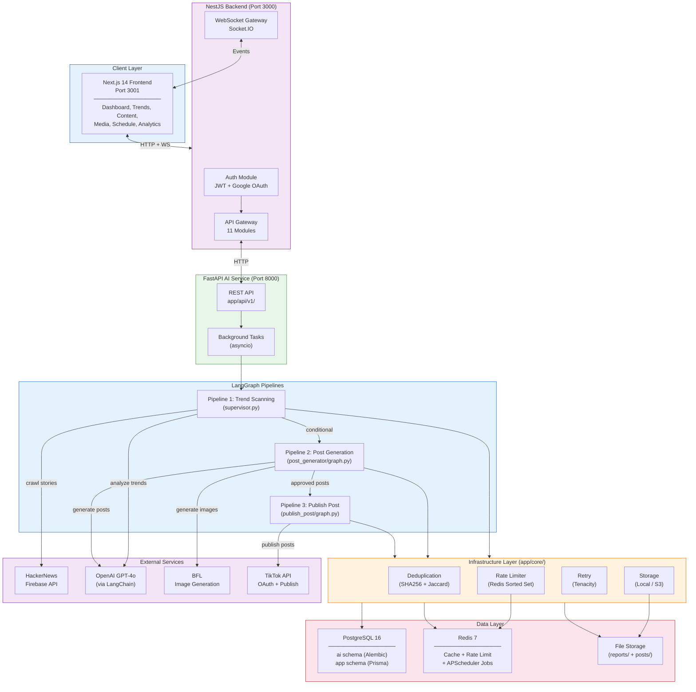

---

## 2. LangGraph Pipeline 1 — Trend Scanning & Analysis

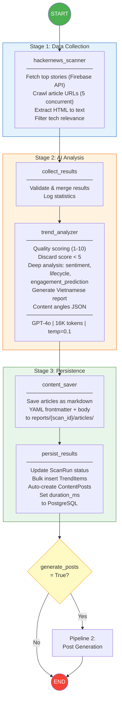

---

## 3. LangGraph Pipeline 2 — Post Generation Agent

```mermaid
graph TD
    START((START)) --> STRATEGY

    STRATEGY["strategy_alignment<br/>─────────────────<br/>Load TrendItems from DB<br/>Read trend report markdown<br/>Load strategy config<br/>Select trends + angles + formats<br/>─────────────────<br/>GPT-4o | 8K tokens | temp=0.7"]

    STRATEGY --> CONTENT["content_generation<br/>─────────────────<br/>7 format templates:<br/>  quick_tips, hot_take,<br/>  trending_breakdown, did_you_know,<br/>  tutorial_hack, myth_busters,<br/>  behind_the_tech<br/>Hook + CTA + Hashtags<br/>─────────────────<br/>GPT-4o | 8K tokens | temp=0.7"]

    CONTENT --> IMG_PROMPT["image_prompt_creation<br/>─────────────────<br/>Map format to image style<br/>Generate BFL prompt<br/>Aspect ratio, text overlay<br/>─────────────────<br/>GPT-4o | 4K tokens | temp=0.1"]

    IMG_PROMPT --> IMG_GEN["image_generation<br/>─────────────────<br/>Call BFL API<br/>Save image to storage"]

    IMG_GEN --> REVIEW["auto_review<br/>─────────────────<br/>7 Criteria (weighted):<br/>Hook strength (20%)<br/>Value density (15%)<br/>Data points (15%)<br/>Strategy alignment (15%)<br/>Originality (15%)<br/>CTA quality (10%)<br/>Format compliance (10%)<br/>─────────────────<br/>GPT-4o | 4K tokens | temp=0.1"]

    REVIEW --> ROUTER{review_router<br/>─────────<br/>score < 7 AND<br/>revision < 2?}

    ROUTER -->|"revise<br/>(revision_count++)"| CONTENT
    ROUTER -->|"package<br/>(score >= 7 or max revisions)"| OUTPUT

    OUTPUT["output_packaging<br/>─────────────────<br/>Build final JSON output<br/>Enrich: word_count, read_time,<br/>  posting_day, timing_window<br/>Save to storage + PostgreSQL<br/>to posts/{scan_id}/<br/>to content_posts table"]

    OUTPUT --> END_NODE((END))

    style START fill:#4caf50,color:#fff
    style END_NODE fill:#f44336,color:#fff
    style ROUTER fill:#fff9c4,stroke:#f9a825
    style REVIEW fill:#ffebee,stroke:#c62828
```

---

## 4. LangGraph Pipeline 3 — Publish Post Agent

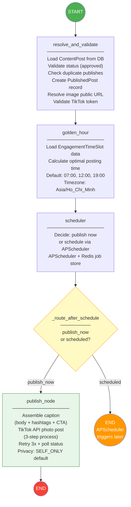

---

## 5. Database Entity Relationship Diagram

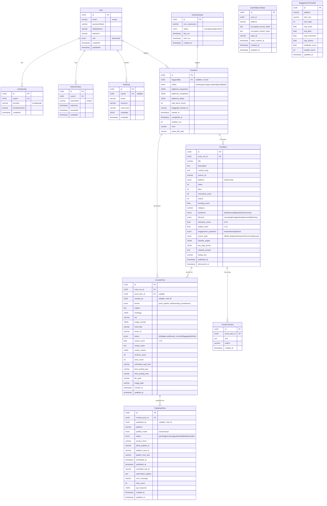

---

## 6. API Endpoint Map

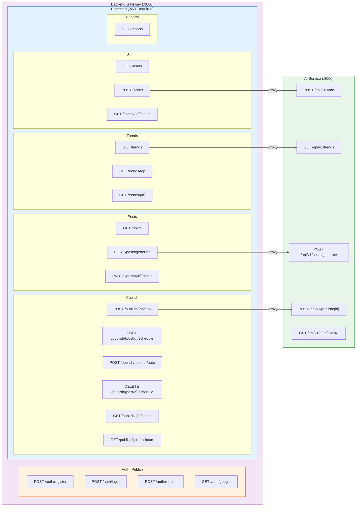

---

## 7. Data Flow — End-to-End Request Lifecycle

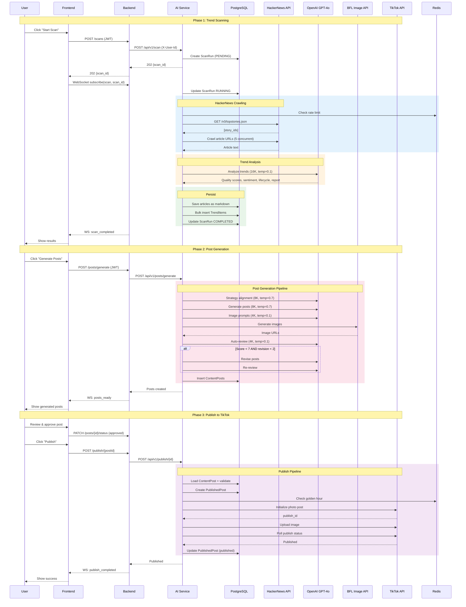

---

## 8. LLM Configuration Map

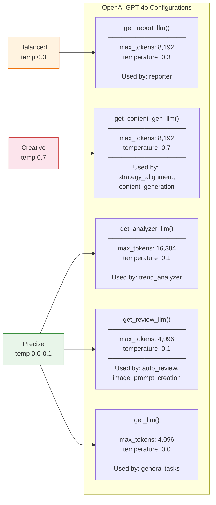

---

## 9. Scan Run State Machine

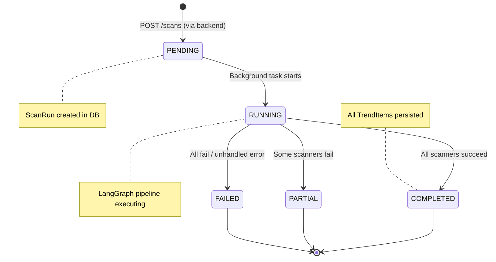

---

## 10. Content Post Review Lifecycle

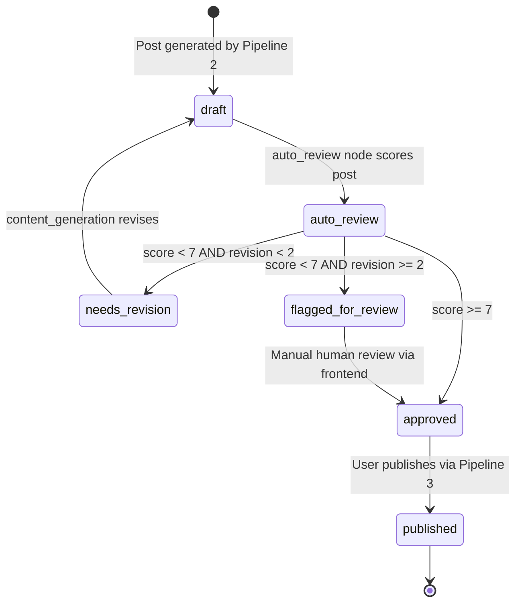

---

## 11. Publish Post State Machine

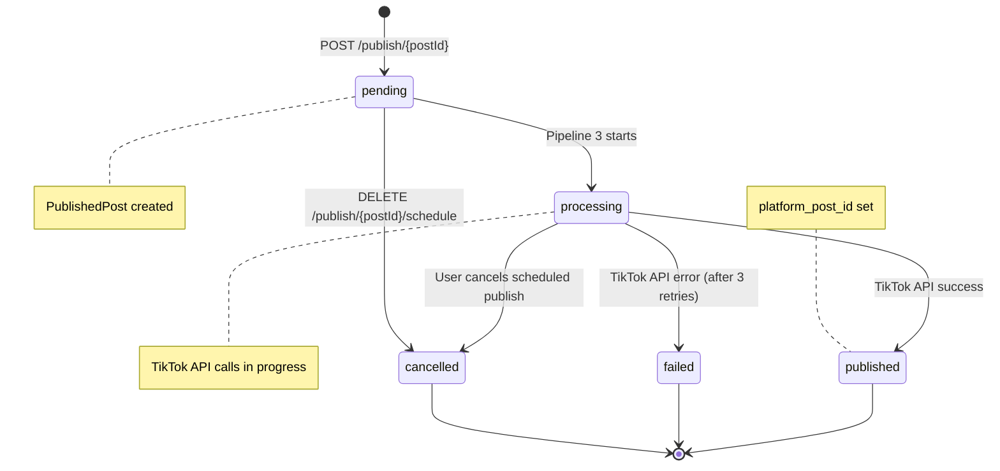

---

## 12. Infrastructure & Deployment

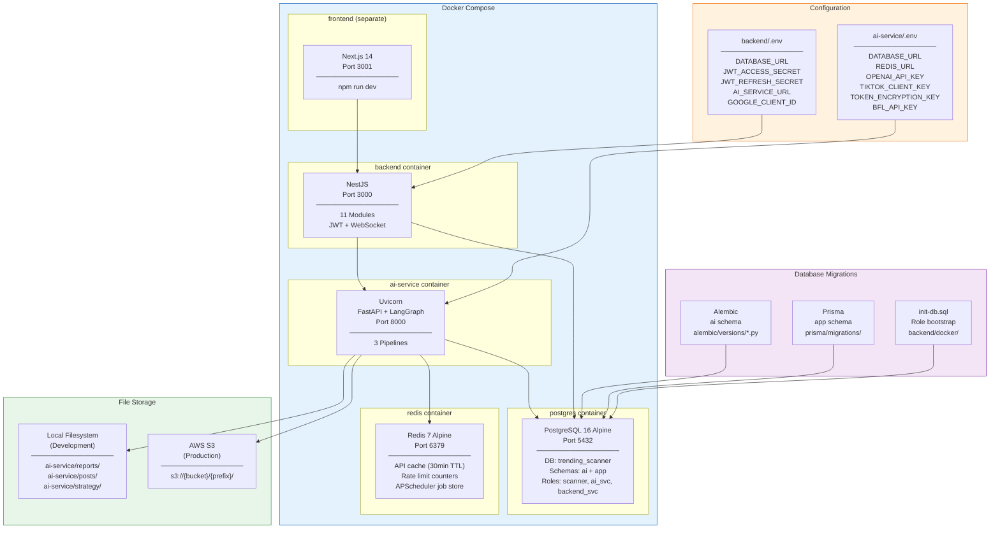
