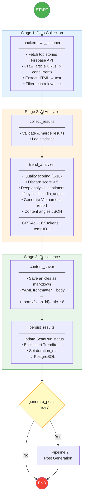
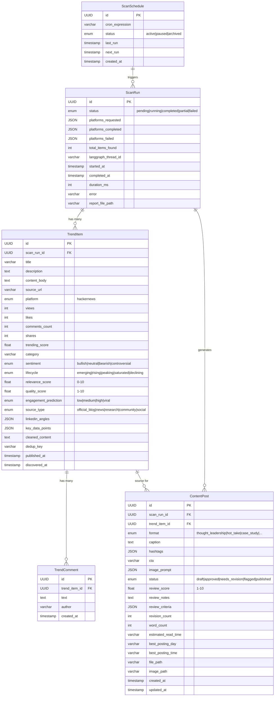
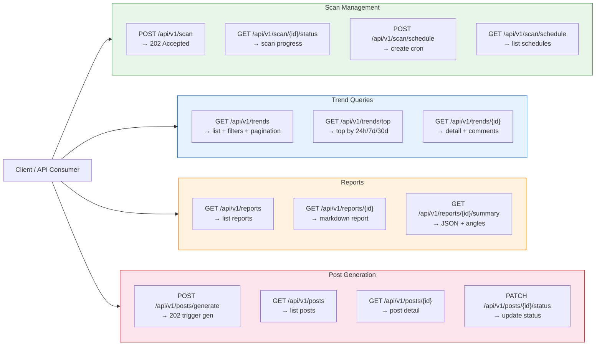
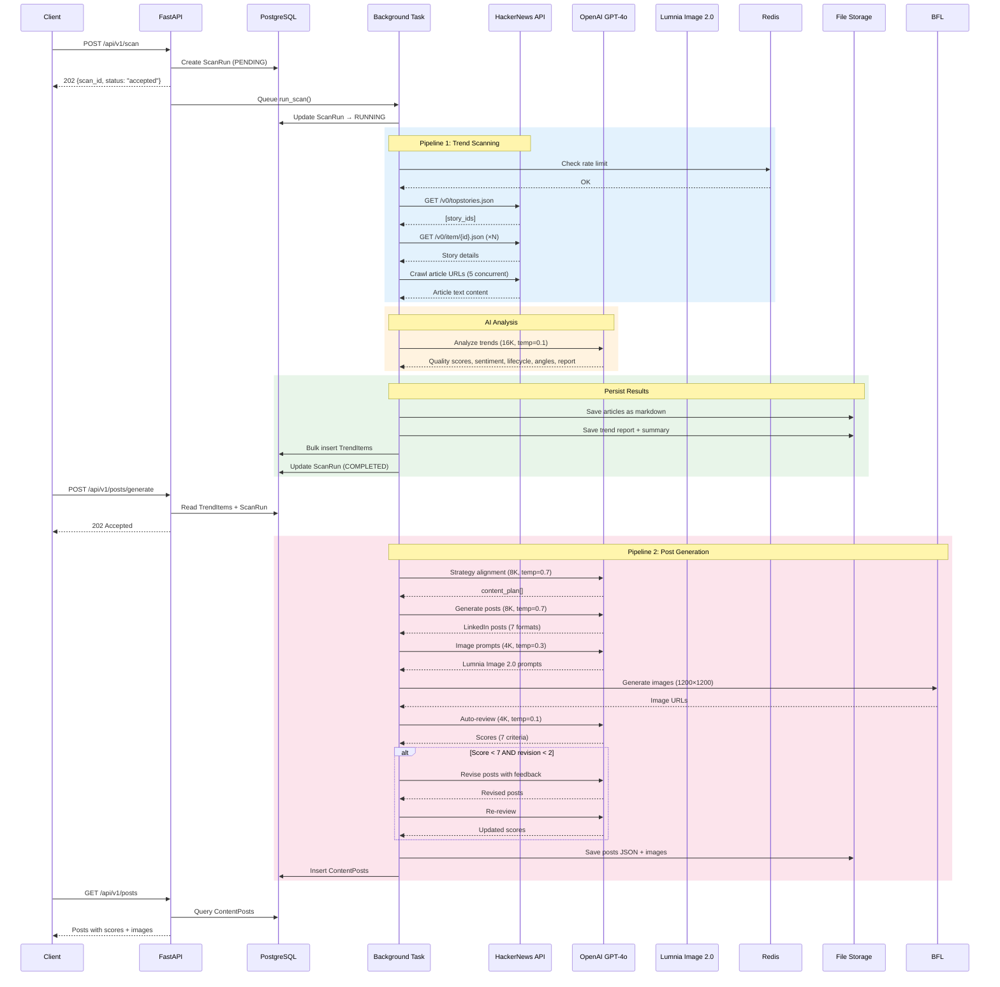
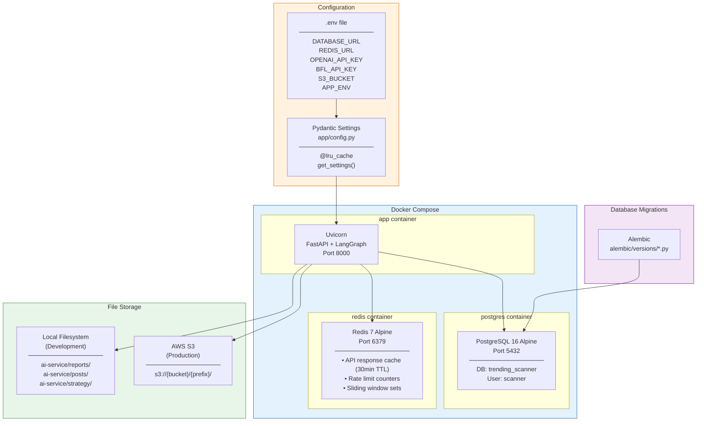
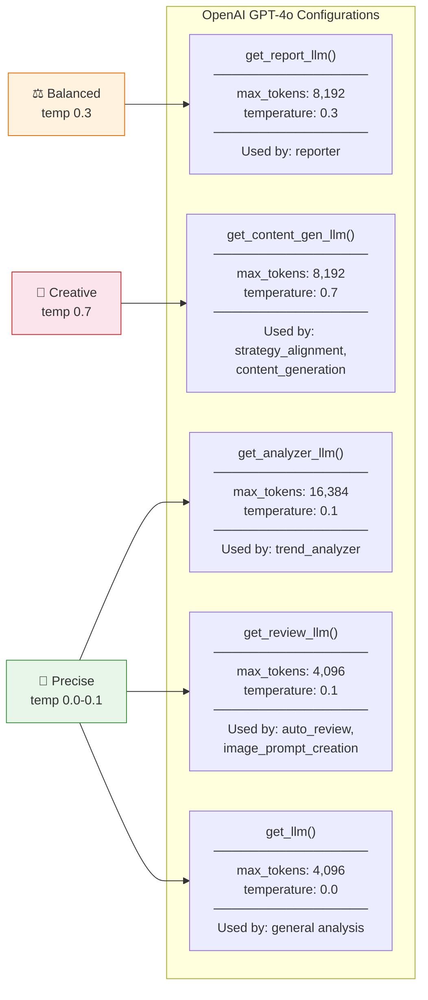
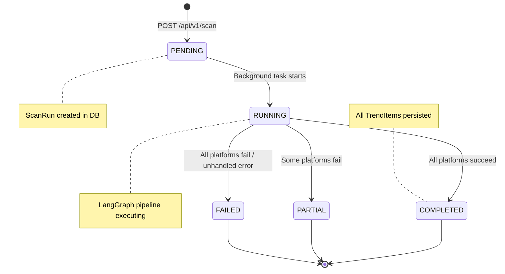
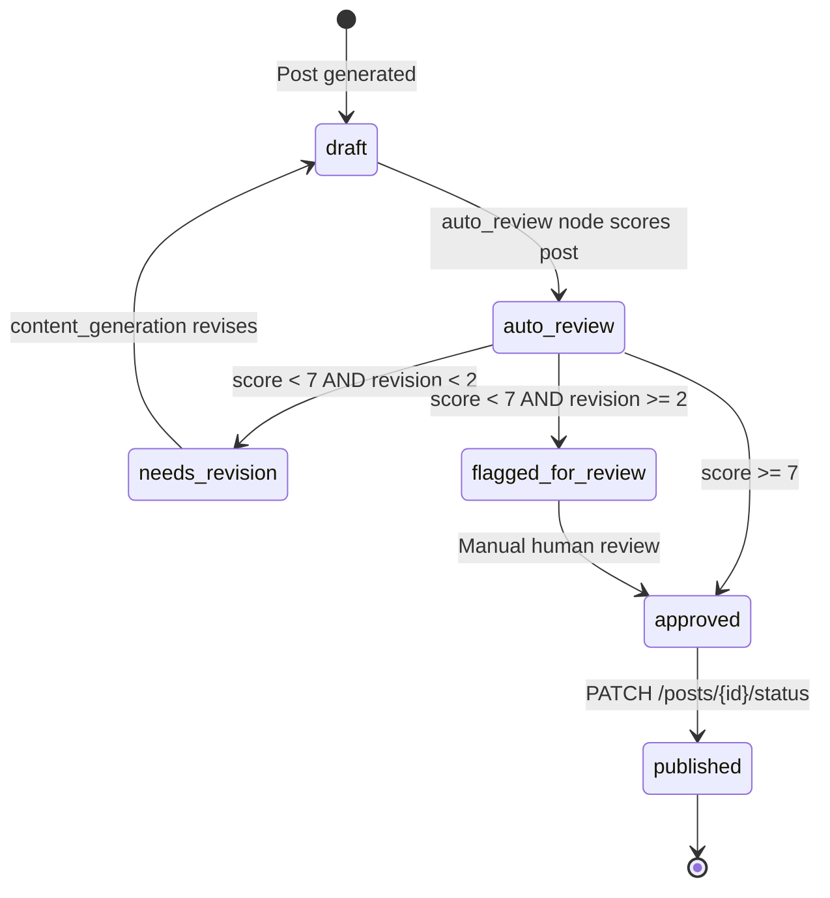

# Marketing Content Pipeline — Architecture Diagrams

## 1. High-Level System Architecture

```mermaid
graph TB
    subgraph CLIENT["👤 Client Layer (Planned)"]
        FE["Next.js 15 Frontend<br/>(Planned - Phase 3)"]
        BE["NestJS Backend<br/>(Planned - Phase 3)"]
    end

    subgraph FASTAPI["🚀 FastAPI Application (Port 8000)"]
        API["REST API<br/>app/api/v1/"]
        BG["Background Tasks<br/>(asyncio)"]
    end

    subgraph LANGGRAPH["🤖 LangGraph Pipelines"]
        P1["Pipeline 1: Trend Scanning<br/>(supervisor.py)"]
        P2["Pipeline 2: Post Generation<br/>(post_generator/graph.py)"]
    end

    subgraph INFRA["⚙️ Infrastructure Layer (app/core/)"]
        RL["Rate Limiter<br/>(Redis Sorted Set)"]
        DD["Deduplication<br/>(SHA256 + Jaccard)"]
        RT["Retry<br/>(Tenacity)"]
        ST["Storage<br/>(Local / S3)"]
    end

    subgraph DATA["💾 Data Layer"]
        PG["PostgreSQL 16<br/>(asyncpg + SQLAlchemy 2.0)"]
        RD["Redis 7<br/>(Cache + Rate Limit)"]
        FS["File Storage<br/>(reports/ + posts/)"]
    end

    subgraph EXTERNAL["🌐 External Services"]
        HN["HackerNews<br/>Firebase API"]
        OAI["OpenAI GPT-4o<br/>(via LangChain)"]
        Lumnnia Image 2.0["Lumnnia Image 2.0<br/>Image Generation"]
    end

    FE <-->|HTTP| BE
    BE <-->|HTTP| API
    API --> BG
    BG --> P1
    P1 -->|conditional| P2

    P1 --> INFRA
    P2 --> INFRA

    INFRA --> PG
    INFRA --> RD
    INFRA --> FS

    P1 -->|crawl stories| HN
    P1 -->|analyze trends| OAI
    P2 -->|generate posts| OAI
    P2 -->|generate images| BFL

    RL --> RD
    ST --> FS

    style CLIENT fill:#f5f5f5,stroke:#999,stroke-dasharray: 5 5
    style FASTAPI fill:#e8f5e9,stroke:#388e3c
    style LANGGRAPH fill:#e3f2fd,stroke:#1565c0
    style INFRA fill:#fff3e0,stroke:#ef6c00
    style DATA fill:#fce4ec,stroke:#c62828
    style EXTERNAL fill:#f3e5f5,stroke:#7b1fa2
```

---

## 2. LangGraph Pipeline 1 — Trend Scanning & Analysis



---

## 3. LangGraph Pipeline 2 — Post Generation Agent

```mermaid
graph TD
    START((START)) --> STRATEGY

    STRATEGY["strategy_alignment<br/>─────────────────<br/>• Load TrendItems from DB<br/>• Read trend report markdown<br/>• Load strategy config<br/>• Select trends + angles + formats<br/>─────────────────<br/>GPT-4o · 8K tokens · temp=0.7"]

    STRATEGY --> CONTENT["content_generation<br/>─────────────────<br/>• 7 format templates:<br/>  thought_leadership, hot_take,<br/>  case_study, tutorial,<br/>  industry_analysis, career_advice,<br/>  behind_the_scenes<br/>• LinkedIn formatting rules<br/>• Hook + CTA + Hashtags<br/>─────────────────<br/>GPT-4o · 8K tokens · temp=0.7"]

    CONTENT --> IMG_PROMPT["image_prompt_creation<br/>─────────────────<br/>• Map format → image style<br/>• Generate Lumnia2.0 prompt<br/>• Aspect ratio, text overlay<br/>─────────────────<br/>GPT-4o · 4K tokens · temp=0.3"]

    IMG_PROMPT --> IMG_GEN["image_generation<br/>─────────────────<br/>• Call Lumnia2.0 Model<br/>• 1200×1200 for LinkedIn<br/>• Save image to storage"]

    IMG_GEN --> REVIEW["auto_review<br/>─────────────────<br/>7 Criteria (weighted):<br/>• Hook strength (20%)<br/>• Value density (15%)<br/>• Data points (15%)<br/>• Strategy alignment (15%)<br/>• Originality (15%)<br/>• CTA quality (10%)<br/>• Format compliance (10%)<br/>─────────────────<br/>GPT-4o · 4K tokens · temp=0.1"]

    REVIEW --> ROUTER{review_router<br/>─────────<br/>score < 7 AND<br/>revision < 2?}

    ROUTER -->|"revise<br/>(revision_count++)"| CONTENT
    ROUTER -->|"package<br/>(score ≥ 7 or max revisions)"| OUTPUT

    OUTPUT["output_packaging<br/>─────────────────<br/>• Build final JSON output<br/>• Enrich: word_count, read_time,<br/>  posting_day, timing_window<br/>• Save to storage + PostgreSQL<br/>→ posts/{scan_id}/<br/>→ content_posts table"]

    OUTPUT --> END_NODE((END))

    style START fill:#4caf50,color:#fff
    style END_NODE fill:#f44336,color:#fff
    style ROUTER fill:#fff9c4,stroke:#f9a825
    style REVIEW fill:#ffebee,stroke:#c62828
```



---

## 4. Database Entity Relationship Diagram



---

## 5. API Endpoint Map



---

## 6. Data Flow — End-to-End Request Lifecycle



---

## 7. Infrastructure & Deployment



---

## 8. LLM Configuration Map



---

## 9. Scan Run State Machine



---

## 10. Content Post Review Lifecycle


